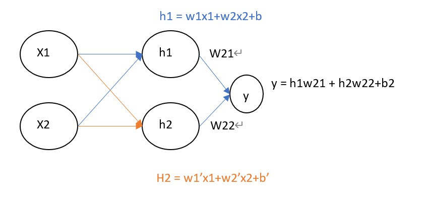
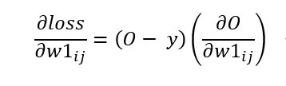
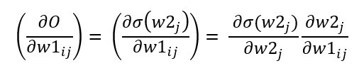
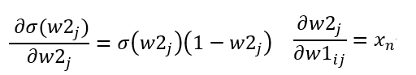
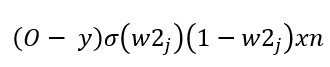
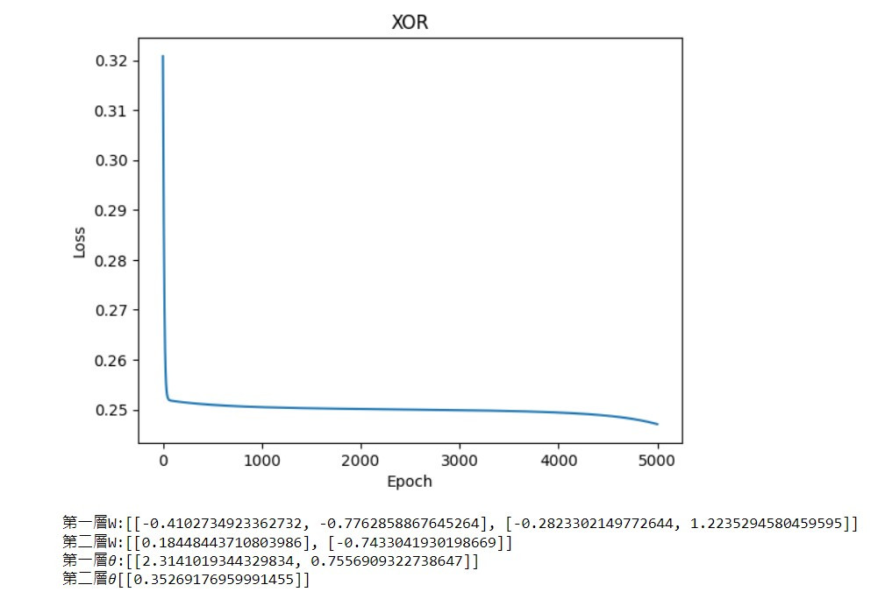

# 【day27】手刻神經網路來解決XOR問題-多層感知器 (Multilayer perceptron) (下)

> **發布日期:** 2022-10-01 20:49:22  
> **原文連結:** [https://ithelp.ithome.com.tw/articles/10302158](https://ithelp.ithome.com.tw/articles/10302158)

---

# 手刻多層感知器

今天的目錄如下:

1.建立與初始化資料  
2.架構神經網路模型  
3.更新參數  
4.顯示結果

## 建立與初始化資料

與昨天相同我會把它寫成class的形式，因為是多層感知器，我們需要根據資料設定每一層的參數，在這裡我們先設定一下所有邏輯閘的資料集。

```
x = [[0.,0.], [0.,1.], [1.,0.], [1.,1.]]
x = torch.tensor(x)

XOR_y = torch.tensor([[0.], [1.], [1.], [0.]])
AND_y = torch.tensor([[0.], [0.], [0.], [1.]])
OR_y = torch.tensor([[0.], [1.], [1.], [1.]])
```

  
接下來要建立上圖的神經網路架構，所以需要來了解每一層的維度大小，首先輸入是(4,2)，進入到隱藏層則要縮到(2,2)，並且要完成`y=wx+b`這一個公式，根據上圖可以知道所有的隱藏層輸入都是h=w1x1+w2x2+b，只是每一個輸入的w1、w2、b都不相同而已。

所以我們將公式轉換為矩陣格式y = WX+b中的`W、b`必須符合輸入大小，所以`輸入到隱藏層W是(2,2)`，`隱藏層到輸出則是(2,1)`，最後寫在\_\_init\_\_裡就可以隨時調整各層的神經元數量了。

```
class model:
    def __init__(self,inputs_shape , hidden_shape ,output_shape):
        #requires_grad=True 表示之後能夠被反向傳播(pytorch用法)
        #numpu改用np.random.uniform(size=(input_shape, hidden_shape))
        self.w1 = torch.randn(inputs_shape, hidden_shape, requires_grad=True)
        self.w2 = torch.randn(hidden_shape, output_shape, requires_grad=True)
        
        self.b1 = torch.randn(1,hidden_shape, requires_grad=True)
        self.b2 = torch.randn(1,output_shape, requires_grad=True)
        
        self.loss = []
        self.mse = MSELoss()
```

## 架構神經網路模型

昨天說到神經網路的三個步驟`前向傳播`、`反向傳播計算梯度`、`梯度下降更新數值`，不過在前向傳播前我們需要定義激勵函數，將我們每一層的結果都變成非線性的結果。

```
def sigmoid(self, x):
    #numpy改用np.exp
    return 1 / (1 + torch.exp(-x))
```

接下來開始定義前向傳播的公式wx+b，這邊用self的寫法是因為我們在反向傳播時還需要用到這些數值

```
def forward(self,x):
        #pytorch中@代表矩陣相乘用*只會代表相同index的數字相乘
        #numpy須將@改用dot EX:np.dot(x, self.w1)
        #輸入到隱藏
        h = x @ self.w1 + self.b1
        h_out = self.sigmoid(h)
        
        #隱藏到輸出
        output = h_out @ self.w2 + self.b2
        outpu_fin = self.sigmoid(output)
        
        return outpu_fin
```

## 更新參數

### pytorch

在pytorch當中計算梯度非常簡單，因為只需設定了`requires_grad=True`，就能夠直接使用`.grad`將梯度計算完畢。pytorch也能夠使用`.backward()`快速的做反向傳播更新梯度數值，這個我們先前用過了很多次只是我們不知道這個function的實際含意。

```
def updata(self, loss, lr):
    loss.backward()
    with torch.no_grad():
        self.w1 -= self.w11.grad * lr            
        self.w2 -= self.w21.grad * lr

        self.b2 -= self.b2.grad * lr
        self.b1 -= self.b1.grad * lr

        self.w11.grad.zero_()
        self.w21.grad.zero_()

        self.b1.grad.zero_()
        self.b2.grad.zero_()
```

### numpy

但numpy更新梯度的方式就很困難了，因為在這裡我們必須對所有要更新的數值做偏微分，而這個過程會非常的複雜。

經過昨天[【day26】手刻神經網路來解決XOR問題-多層感知器 (Multilayer perceptron) (上)](https://ithelp.ithome.com.tw/articles/10301417)的課程中學習到的梯度計算方式，我們能夠知道若要計算出隱藏層的梯度，需要對`計算出的loss值`與`輸入到隱藏層(w1)`的資料做偏微分(O是預測輸出，W是輸入到隱藏層的資料、i是輸入、j連接到第幾個隱藏層神經元)  


接下來分解∂O/∂w1  


其中∂σ(w2)/∂w2)為sigmoid函數的導數`f'(x) = f(x)(1 - f(x))`。  
輸入則是`∂w2/∂w1 = xn`(W = wx+b)  


我們就會得到以下公式，這公式也代表`(預測輸出-實際值)*delsigmoid(最後的輸出)*最後的權重*輸入`  


接下來計算好梯度後，就與pytorch更新梯度的方式相同了。

```
def updata(self, x, y, lr):
        loss = 0.5 * (y - self.output_final) ** 2
        self.loss.append(np.sum(loss))
        error_term = (self.output_final - y)

        #隱藏層梯度(注意這裡還多一層simgoid)
        grad1 = x.T @ (((error_term * self.delsigmoid(self.output_final)) * self.w2.T) * self.delsigmoid(self.h1_out))

        #輸出層梯度
        grad2 = self.h1_out.T @ (error_term * self.delsigmoid(self.output_final))

        self.w1 -= lr * grad1
        self.w2 -= lr * grad2
        self.b1 -= np.sum(lr * ((error_term * self.delsigmoid(self.output_final)) * self.w2.T) * self.delsigmoid(self.h1_out), axis=0)
        self.b2 -= np.sum(lr * error_term * self.delsigmoid(self.output_final), axis=0)
        
def delsigmoid(self, x):
        return x * (1 - x)
```

## 顯示結果

最後只要測試結果是否正確，以及繪製出loss折線圖就大功告成了

```
def predict(self, x):
        #pytorch需要加入torch.no_grad
        with torch.no_grad():
            return self.forward(x) >= 0.5 
        

    def show(self, title):
        plt.plot(self.loss)
        plt.title(title)
        plt.xlabel("Epoch")
        plt.ylabel("Loss")
        plt.show()
        
        print(f'第一層W:{self.w11.tolist()} \n第二層W:{self.w21.tolist()} \n第一層?:{self.b1.tolist()} \n第二層?{self.b2.tolist()}')
        
model.show()
```



測試XOR結果

```
model.predict(x)
------------------------顯示------------------------
array([[ True],
       [False],
       [False],
       [ True]])
```

今天的程式比單層神經網路還要複雜一點，最主要的原因還是反向傳播的計算，如果都了解了這些計算方式後，我相信手刻出其他神經網路就只是時間早晚的問題了。

## 完整程式碼(pytorch)

```
import torch
from torch.nn import MSELoss
import matplotlib.pyplot as plt

class model:
    def __init__(self,inputs_shape , hidden_shape ,output_shape):
        self.w1 = torch.randn(inputs_shape, hidden_shape, requires_grad=True)
        self.w2 = torch.randn(hidden_shape, output_shape, requires_grad=True)
        
        self.b1 = torch.randn(1,hidden_shape, requires_grad=True)
        self.b2 = torch.randn(1,output_shape, requires_grad=True)
        self.loss = []
        self.mse = MSELoss()
        

    def fit(self, x, y , lr=0.2, epoch=200):
        for i in range(epoch):
            output = self.forward(x)
            loss = self.mse(output, y)
            self.loss.append(float(loss))
            self.updata(loss,lr)
            
    
    
    def updata(self, loss, lr):
        loss.backward()
        with torch.no_grad():
            self.w1 -= self.w1.grad * lr            
            self.w2 -= self.w2.grad * lr
            
            self.b2 -= self.b2.grad * lr
            self.b1 -= self.b1.grad * lr

            self.w1.grad.zero_()
            self.w2.grad.zero_()

            self.b1.grad.zero_()
            self.b2.grad.zero_()
            
    def forward(self,x):
        h = x @ self.w1 + self.b1
        h_out = self.sigmoid(h)
        
        output = h_out @ self.w2 + self.b2
        outpu_fin = self.sigmoid(output)
        
        return outpu_fin
    
    def sigmoid(self, x):
        return 1 / (1 + torch.exp(-x))
    
    def predict(self, x):
        with torch.no_grad():
            return self.forward(x) >= 0.5 
        

    def show(self, title):
        plt.plot(self.loss)
        plt.title(title)
        plt.xlabel("Epoch")
        plt.ylabel("Loss")
        plt.show()
        
        print(f'第一層W:{self.w1.tolist()} \n第二層W:{self.w2.tolist()} \n第一層?:{self.b1.tolist()} \n第二層?{self.b2.tolist()}')
```

```
x = [[0.,0.], [0.,1.], [1.,0.], [1.,1.]]
x = torch.tensor(x)

XOR_y = torch.tensor([[0.], [1.], [1.], [0.]])
AND_y = torch.tensor([[0.], [0.], [0.], [1.]])
OR_y = torch.tensor([[0.], [1.], [1.], [1.]])

XOR_model = model(2, 2, 1)
AND_model = model(2, 2, 1)
OR_model = model(2, 2, 1)

XOR_model.fit(x, XOR_y, 0.2, 5000)
AND_model.fit(x, AND_y,0.2, 5000)
OR_model.fit(x, OR_y,0.2, 5000)
```

```
XOR_model.show('XOR')
AND_model.show('AND')
OR_model.show('OR')
```

```
print(XOR_model.predict(x),AND_model.predict(x),OR_model.predict(x),sep='\n\n')
```

## 完整程式碼(numpy)

```
import numpy as np

class model:
    def __init__(self, input_shape, hidden_shape, output_shape):
     

        self.w1 = np.random.uniform(size=(input_shape, hidden_shape))
        self.w2 = np.random.uniform(size=(hidden_shape, output_shape))

        self.b1 = np.random.uniform(size=(1, hidden_shape))
        self.b2 = np.random.uniform(size=(1, output_shape))

        self.loss = []

    def updata(self, x, y, lr):
        loss = 0.5 * (y - self.output_final) ** 2
        self.loss.append(np.sum(loss))
        error_term = (self.output_final - y)

        #隱藏層梯度(注意這裡還多一層simgoid)
        grad1 = x.T @ (((error_term * self.delsigmoid(self.output_final)) * self.w2.T) * self.delsigmoid(self.h1_out))

        #輸出層梯度
        grad2 = self.h1_out.T @ (error_term * self.delsigmoid(self.output_final))

      

        self.w1 -= lr * grad1
        self.w2 -= lr * grad2
        self.b1 -= np.sum(lr * ((error_term * self.delsigmoid(self.output_final)) * self.w2.T) * self.delsigmoid(self.h1_out), axis=0)
        self.b2 -= np.sum(lr * error_term * self.delsigmoid(self.output_final), axis=0)

    def sigmoid(self, x):
        return 1 / (1 + np.exp(-x))

    def delsigmoid(self, x):
        return x * (1 - x)

    def forward(self, x):

        self.h1 = np.dot(x, self.w1) + self.b1
        self.h1_out = self.sigmoid(self.h1)

        self.output = np.dot(self.h1_out, self.w2) + self.b2
        self.output_final = self.sigmoid(self.output)

        return self.output_final

    def predict(self, x):
        return self.forward(x) >= 0.5

    def fit(self,x,y,lr,epoch):
        for _ in range(epoch):
            self.forward(x)
            self.updata(x,y,lr)
            
    def show(self, title):
        plt.plot(self.loss)
        plt.title(title)
        plt.xlabel("Epoch")
        plt.ylabel("Loss")
        plt.show()

        print(f'第一層W:{self.w1.tolist()} \n第二層W:{self.w2.tolist()} \n第一層?:{self.b1.tolist()} \n第二層?{self.b2.tolist()}')
```

```
x = np.array([[0,0], [0,1], [1,0], [1,1]])

XOR_y = np.array([[0], [1], [1], [0]])
AND_y =np.array([[0], [0], [0], [1]])
OR_y = np.array([[0], [1], [1], [1]])

XOR_model = model(2, 2, 1)
AND_model = model(2, 2, 1)
OR_model = model(2, 2, 1)

XOR_model.fit(x, XOR_y, 0.2, 5000)
AND_model.fit(x, AND_y,0.2, 5000)
OR_model.fit(x, OR_y,0.2, 5000)
```

```
XOR_model.show('XOR')
AND_model.show('AND')
OR_model.show('OR')
```

```
print(XOR_model.predict(x),AND_model.predict(x),OR_model.predict(x),sep='\n\n')
```

課程中的程式碼都能從我的github專案中看到  
<https://github.com/AUSTIN2526/learn-AI-in-30-days>
